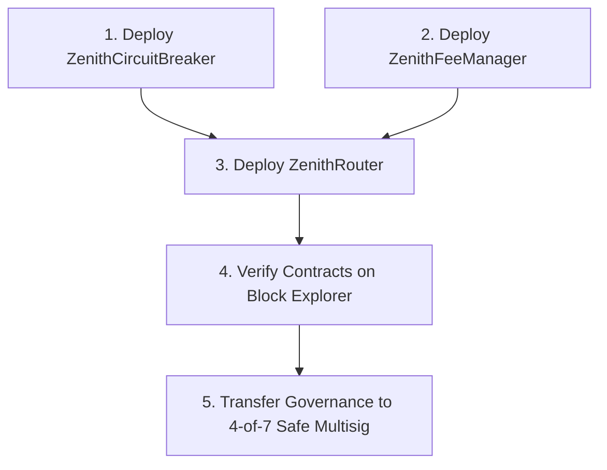

# ZENITH SWAP — Trade Beyond Limits

<div align="center">


-7C3AED?style=for-the-badge)
-00E599?style=for-the-badge)


**Universal Multi-Chain Decentralized Trading, Smart Routing & Execution Engine**

</div>

---

## 📑 Table of Contents

1. [Overview & Core Principles](#-overview--core-principles)
2. [Monorepo Architecture & Structure](#-monorepo-architecture--structure)
3. [Smart Contract Deployment Guide](#-smart-contract-deployment-guide)
   - [Contract Locations & Artifacts](#contract-locations--artifacts)
   - [Deployment Dependency Order](#deployment-dependency-order)
   - [Step-by-Step Foundry Deployment](#step-by-step-foundry-deployment)
   - [Verification & Multisig Handover](#verification--multisig-handover)
4. [Frontend Web App Deployment Guide](#-frontend-web-app-deployment-guide)
   - [Environment Variables](#environment-variables)
   - [Vercel & Netlify Deployment](#vercel--netlify-deployment)
   - [Docker & Containerized Deployment](#docker--containerized-deployment)
5. [Supported Chains & Execution Topology](#-supported-chains--execution-topology)
6. [Security, Risk Engine & Circuit Breaker](#-security-risk-engine--circuit-breaker)
7. [Local Development & Testing](#-local-development--testing)
8. [Documentation Links](#-documentation-links)

---

## 🌟 Overview & Core Principles

**ZENITH SWAP** is an institutional-grade, non-custodial decentralized trading platform engineered to provide seamless liquidity aggregation and atomic cross-chain swaps across 21 EVM, L2, L3, and Solana SVM networks.

- **Non-Custodial Architecture:** Zero private key storage; contracts never hold user balances outside of atomic swap execution.
- **Dynamic Best Execution Router (EES):** Multi-DEX splitting and scoring based on price impact, gas ratios, bridge latency, and liquidity depth.
- **Pre-Flight Simulation & Honeypot Detection:** Real-time static analysis and `eth_call` transaction dry-runs prior to wallet signature prompts.
- **MEV Protection:** Automated Flashbots private mempool routing for frontrunning and sandwich protection.
- **Automated Circuit Breaker:** Instant anomaly pause for abnormal price deviations (>15%) or simulation failure spikes.

---

## 📂 Monorepo Architecture & Structure

The repository is configured as an npm workspace monorepo dividing business logic into modular, independently versioned packages, smart contracts, and frontend applications:

```
ZENITH/
├── apps/
│   └── web/                            # Production Web Client (React 18, Vite 5, TailwindCSS)
│       ├── src/
│       │   ├── components/             # UI Components (Simple Swap, Pro Trading, Risk Badges)
│       │   ├── stores/                 # Zustand Single-Source-of-Truth Store
│       │   ├── utils/                  # Web Client Helpers
│       │   ├── App.tsx                 # Root Component
│       │   └── main.tsx                # Entry Point
│       ├── .env.example                # Web App Environment Configuration Template
│       └── package.json                # @zenith/web package definition
│
├── contracts/
│   └── evm/                            # Foundry EVM Smart Contracts Suite
│       ├── src/
│       │   ├── treasury/
│       │   │   ├── ZenithTreasury.sol      # Sovereign Protocol Revenue Vault
│       │   │   ├── ZenithFeeController.sol  # Protocol Fee & AMM Tier Controller
│       │   │   └── interfaces/             # IZenithTreasury & IZenithFeeController
│       │   ├── v1/                         # Zenith V1 Constant Product AMM Suite
│       │   ├── v2/                         # Zenith V2 Multi-Fee AMM Suite
│       │   ├── v3/                         # Zenith V3 Concentrated Liquidity AMM Suite
│       │   ├── router/
│       │   │   └── ZenithRouter.sol        # Unified AMM Aggregator Router
│       │   ├── ZenithCrossChainRouter.sol  # Sovereign Cross-Chain Swap Router
│       │   └── ZenithCircuitBreaker.sol    # Emergency Guardian & Governance Pauser
│       ├── script/
│       │   └── Deploy.s.sol                # Automated Foundry Deployment Script
│       ├── test/                           # Foundry Test Suites (Treasury, Controller, AMMs)
│       ├── foundry.toml                    # Foundry Build, Solc 0.8.24 & Optimization Config
│       ├── .env.example                    # Smart Contract Deployment Variables
│       └── package.json                    # @zenith/contracts-evm
│
├── packages/
│   ├── chains/                         # 53 Chain Configurations, RPC Fallbacks & Explorer Metadata
│   ├── execution/                      # State Machine (IDLE -> QUOTE -> EXEC -> RX) & EVM/Solana Adapters
│   ├── routing/                        # Best Execution Router, AMM Math & Bridge Aggregator
│   ├── sdk/                            # Zenith TypeScript SDK
│   ├── security/                       # Token Risk Engine, Honeypot Detector & MEV Protection
│   ├── tokens/                         # Multi-chain Token Registry & Custom Token Importer
│   ├── types/                          # Shared TypeScript Types, Interfaces & Schemas
│   └── ui/                             # Design System Tokens, Theme Definitions & Color Palettes
│
├── docs/                               # Architectural & Governance Documentation
│   ├── TREASURY_ARCHITECTURE.md        # Sovereign Treasury & Fee Controller Topology
│   ├── TREASURY_SECURITY_MODEL.md      # Security Invariants & Access Control Model
│   ├── ARCHITECTURE.md                 # System Topology & Routing Formula
│   └── KEY_CEREMONY_AND_INCIDENT_RUNBOOK.md # Multisig & Emergency Response Runbook
│
├── tests/                              # Comprehensive Monorepo Test Suites (190 Tests)
│
├── package.json                        # Root Workspace Configuration & Monorepo Scripts
└── tsconfig.base.json                  # Monorepo TypeScript Compiler Base
```

---

## ⚡ Smart Contract Deployment Guide

### Contract Locations & Roles

All smart contracts are located in [`contracts/evm/`](file:///e:/APEX/ZENITH/contracts/evm/):

| Contract | File Path | Role & Constructor Parameters |
| :--- | :--- | :--- |
| **ZenithTreasury** | [`ZenithTreasury.sol`](file:///e:/APEX/ZENITH/contracts/evm/src/treasury/ZenithTreasury.sol) | Sovereign protocol revenue vault (`address _governance`) |
| **ZenithFeeController** | [`ZenithFeeController.sol`](file:///e:/APEX/ZENITH/contracts/evm/src/treasury/ZenithFeeController.sol) | Fee ceilings & AMM tier parameters (`address _governance`, `address _treasury`) |
| **ZenithV1Factory / Router** | [`ZenithV1Factory.sol`](file:///e:/APEX/ZENITH/contracts/evm/src/v1/ZenithV1Factory.sol) | V1 Constant product AMM suite |
| **ZenithV2Factory / Router** | [`ZenithV2Factory.sol`](file:///e:/APEX/ZENITH/contracts/evm/src/v2/ZenithV2Factory.sol) | V2 Multi-tier configurable fee AMM suite |
| **ZenithV3Factory / Router** | [`ZenithV3Factory.sol`](file:///e:/APEX/ZENITH/contracts/evm/src/v3/ZenithV3Factory.sol) | V3 Concentrated liquidity AMM suite |
| **ZenithRouter (Unified)** | [`ZenithRouter.sol`](file:///e:/APEX/ZENITH/contracts/evm/src/router/ZenithRouter.sol) | Unified AMM router with automatic treasury fee routing |
| **ZenithCrossChainRouter** | [`ZenithCrossChainRouter.sol`](file:///e:/APEX/ZENITH/contracts/evm/src/ZenithCrossChainRouter.sol) | Cross-chain intent execution with treasury deposit |
| **ZenithCircuitBreaker** | [`ZenithCircuitBreaker.sol`](file:///e:/APEX/ZENITH/contracts/evm/src/ZenithCircuitBreaker.sol) | Emergency guardian & protocol pause control |

### Deployment Dependency Order

Contracts **must** be deployed in the following strict order:



### Step-by-Step Foundry Deployment

#### 1. Setup Environment
Navigate to `contracts/evm/` and copy the environment template:
```bash
cd contracts/evm
cp .env.example .env
```

Configure your `.env` variables:
```ini
DEPLOYER_PRIVATE_KEY=0x...
RPC_URL=https://eth.llamarpc.com
ETHERSCAN_API_KEY=ABC123XYZ...
GOVERNANCE_MULTISIG=0xSafeMultisigAddress...
EMERGENCY_GUARDIAN=0xEmergencyGuardianAddress...
TREASURY_ADDRESS=0xProtocolTreasuryAddress...
DEFAULT_FEE_BPS=5
```

#### 2. Local Simulation / Dry Run
Test the deployment on a local Anvil node or with `--dry-run`:
```bash
forge script script/Deploy.s.sol:DeployZenith --rpc-url $RPC_URL
```

#### 3. Live Deployment & Broadcast
Broadcast the deployment transaction to the target blockchain:
```bash
forge script script/Deploy.s.sol:DeployZenith \
  --rpc-url $RPC_URL \
  --broadcast \
  --verify \
  --etherscan-api-key $ETHERSCAN_API_KEY \
  -vvvv
```

### Verification & Multisig Handover

1. **Verify Contract Sources:**
   If deploying to networks without automated verification during broadcast:
   ```bash
   forge verify-contract <DEPLOYED_ROUTER_ADDRESS> src/ZenithRouter.sol:ZenithRouter --etherscan-api-key $ETHERSCAN_API_KEY --constructor-args $(cast abi-encode "constructor(address,address)" <FEE_MANAGER_ADDRESS> <CIRCUIT_BREAKER_ADDRESS>)
   ```

2. **Multisig Governance Confirmation:**
   Ensure governance permissions are transferred to the protocol's 4-of-7 Safe Multisig according to [§69 Key Ceremony Protocol](file:///e:/APEX/ZENITH/docs/KEY_CEREMONY_AND_INCIDENT_RUNBOOK.md).

---

## 🌐 Frontend Web App Deployment Guide

The frontend is a high-performance React 18 single-page application built with Vite 5.

### Environment Variables

Copy `apps/web/.env.example` to `apps/web/.env`:
```ini
VITE_APP_ENV=production
VITE_APP_NAME="ZENITH"
VITE_APP_URL="https://app.zenith.exchange"
VITE_WALLETCONNECT_PROJECT_ID="your_walletconnect_id"
VITE_ALCHEMY_API_KEY="your_alchemy_key"
VITE_SOLANA_RPC_URL="https://api.mainnet-beta.solana.com"
VITE_ZENITH_ROUTER_ETHEREUM="0x..."
VITE_ZENITH_ROUTER_ARBITRUM="0x..."
VITE_ZENITH_ROUTER_BASE="0x..."
```

### Build Commands

```bash
# Build all packages & the web app
npm run build

# Or build web client directly
npm run build --workspace=@zenith/web
```
The compiled output is emitted to `apps/web/dist/`.

### Vercel / Netlify Deployment

1. **Root Directory:** `.` (Workspace Root)
2. **Build Command:** `npm run build`
3. **Output Directory:** `apps/web/dist`
4. **Install Command:** `npm install`

### Docker & Containerized Deployment

To deploy using Docker and Nginx:

```dockerfile
# Build Stage
FROM node:20-alpine AS builder
WORKDIR /app
COPY package*.json ./
COPY packages/ ./packages/
COPY apps/ ./apps/
COPY contracts/evm/package.json ./contracts/evm/
COPY tsconfig.base.json ./
RUN npm ci
RUN npm run build

# Production Static Server Stage
FROM nginx:alpine
COPY --from=builder /app/apps/web/dist /usr/share/nginx/html
COPY apps/web/nginx.conf /etc/nginx/conf.d/default.conf
EXPOSE 80
CMD ["nginx", "-g", "daemon off;"]
```

---

## ⛓️ Universal Network Support Tier System (52+ Networks)

ZENITH features a formal, dynamic **Network Support Tier System** connecting 52+ distinct blockchain networks:

| Tier | Classification | Feature Set & Availability | Network Targets |
| :-- | :--- | :--- | :--- |
| **Tier 1** | **Core / Full Production** | Full DEX routing, pre-flight simulation, private MEV relay, automated failover RPCs | **Ethereum, Base, Arbitrum, Optimism, Polygon, BNB Chain, Avalanche, Solana** (8 networks) |
| **Tier 2** | **Expanding Production** | Smart DEX routing, live token discovery, security risk scoring, and portfolio tracking | **Unichain, Linea, zkSync, Scroll, Blast, Zora, World Chain, Mantle, Celo, Gnosis, Sonic, Soneium, Berachain, Cronos, X Layer, Sei, Sui, Aptos, NEAR, Cosmos Hub, Osmosis, Injective** (22 networks) |
| **Tier 3** | **Experimental / Limited** | Specialized networks with selective liquidity, constrained simulation, or customized token standards | **Arbitrum Nova, Polygon zkEVM, Mode, Taiko, Metis, Moonbeam, Moonriver, Rootstock, Tron, TON, Hedera, Algorand, Stellar, XRP Ledger, Cardano, Polkadot, Internet Computer** (17 networks) |
| **Tier 4** | **Research / Adapter Ready** | Architecture prepared in adapter development / testnet validation (swaps safe-gated) | **Bitcoin, Monad, Robinhood Chain, Tempo, MegaETH** (5+ networks) |

### 🛠️ Granular Capability Matrix
Every network exposes 15+ individual capability flags (`wallet`, `tokenDiscovery`, `tokenRisk`, `priceData`, `liquidityDiscovery`, `swap`, `smartRouting`, `simulation`, `portfolio`, `history`, `mevProtection`, `crossChain`, `zenithLiquidity`, `api`, `sdk`) and supported asset standards (`ERC-20`, `SPL`, `Move Coin`, `IBC`, `Runes`, `TRC-20`, etc.).

---

## 🛡️ Security, Risk Engine & Circuit Breaker

### Effective Execution Score (EES)
$$EES = 100 - (\text{PriceImpact} \times 8) - \text{GasPenalty} - \text{SlippagePenalty} - \text{BridgeLatencyPenalty}$$

### Token Risk Engine Checks
Every asset undergoes pre-trade evaluation:
- Honeypot simulation (`isHoneypot: false`)
- Maximum buy/sell tax limits (flags if $>5\%$)
- Whitelist/Blacklist ability detection
- Liquidity lock and top 10 holder concentration analysis

### Emergency Circuit Breaker Protocol
- **Trigger:** Automated trigger on $>15\%$ oracle deviation or $>25\%$ pre-flight simulation reverts.
- **Safe Failure Principle:** Emergency pause halts new routing on the contract level; user funds in wallets or balances are **never locked or confiscated**.
- Full runbook details in [`KEY_CEREMONY_AND_INCIDENT_RUNBOOK.md`](file:///e:/APEX/ZENITH/docs/KEY_CEREMONY_AND_INCIDENT_RUNBOOK.md).

---

## 🛠️ Local Development & Testing

### Prerequisites
- Node.js >= 18.0.0
- npm >= 9.0.0
- Foundry (`forge`, `cast`, `anvil`) for contract compilation/testing

### Installation
```bash
# Clone the repository
git clone https://github.com/zenith-exchange/zenith.git
cd zenith

# Install dependencies across all workspaces
npm install
```

### Running Locally
```bash
# Start Vite development server for Web Client
npm run dev

# Run TypeScript type verification across all packages
npm run type-check

# Run end-to-end integration and state machine tests
npm run test
```

### Running Test Suite
```bash
npm run test
```
Outputs validation across:
- Dynamic 21-Chain Registry
- Token Service & Custom Importer
- Token Risk Engine & Honeypot Analysis
- Best Execution Router & EES Scoring
- Multi-Hop Cross-Chain Routing (Stargate Bridge)
- Circuit Breaker Anomaly Thresholds
- Execution State Machine Lifecycle

---

## 📚 Documentation Links

- [System Architecture Specification](file:///e:/APEX/ZENITH/docs/ARCHITECTURE.md)
- [Application Security & Identity (CSP, RBAC)](file:///e:/APEX/ZENITH/docs/SECURITY_AND_IDENTITY.md)
- [Key Ceremony Protocol & Incident Runbook](file:///e:/APEX/ZENITH/docs/KEY_CEREMONY_AND_INCIDENT_RUNBOOK.md)
- [Compliance, Accessibility & Performance Budgets](file:///e:/APEX/ZENITH/docs/COMPLIANCE_AND_ACCESSIBILITY.md)

---

<div align="center">
  <sub>Built with precision by ZENITH Core Engineering. Released under the MIT License.</sub>
</div>
