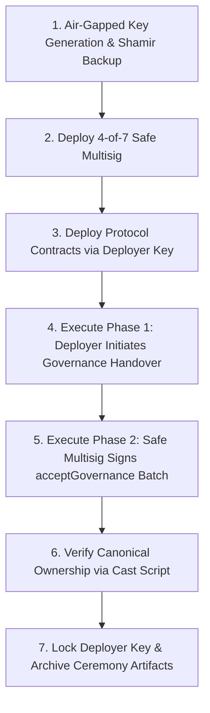
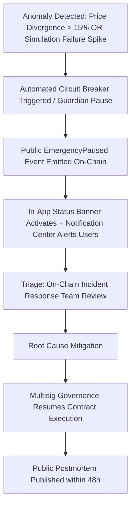

# §69 Multisig Key Ceremony & §70 Incident Response Runbook

## 1. §69 Treasury Key Ceremony Protocol

### Multisig Governance Architecture
- **Multisig Threshold:** **4-of-7 multisig** on Gnosis Safe (Safe v1.4.1+ canonical deployment).
- **Role Assignment:** Sovereign Protocol Governance, Treasury Vault Management, AMM Fee Tier Configuration, and Circuit Breaker Governance.
- **Geographic & Hardware Diversity:** Signers distributed across a minimum of 3 distinct global regions/continents. All signers must utilize hardware wallets (Ledger Nano X / Trezor Model T) configured in air-gapped ceremonies.
- **Zero Hot Keys Invariant:** Automated servers, bots, CI/CD runners, and RPC relays NEVER possess signing keys for treasury, fee controller, or factory admin functions.

---

### Step-by-Step Key Ceremony Execution



#### Step 1: Air-Gapped Key Generation
1. Each of the 7 designated signers boots a clean, offline machine running Tails OS or an air-gapped Ubuntu live environment.
2. Initialize hardware wallet firmware and generate a 24-word BIP-39 mnemonic seed phrase.
3. Record 2 physical copies of the seed on stainless steel or titanium backup plates (e.g., Cryptosteel).
4. Derive public Ethereum address using standard derivation path (`m/44'/60'/0'/0/0`).
5. Export only the public address and PGP-sign the address verification message with the signer's identity key.

#### Step 2: Safe Multisig Deployment
Deploy the Safe 4-of-7 multisig across each canonical target blockchain (Ethereum, Arbitrum, Base, Polygon, Optimism, BNB Chain) using Create2 / Safe Proxy Factory:
- **Threshold:** 4
- **Owners:** `[Signer1, Signer2, Signer3, Signer4, Signer5, Signer6, Signer7]`
- **Fallback Handler:** Compatibility Fallback Handler (`0xfd0732Dc9E303e09fCEF36543da46d0986000000`)

#### Step 3: Automated Handover Batch Generation
Run the Safe transaction builder generator from the workspace root:
```bash
npx tsx scripts/generate-safe-multisig-txs.ts
```
This generates:
- `deployments/multisig/phase1_deployer_initiation_batch.json` (for the deployer wallet)
- `deployments/multisig/phase2_safe_acceptance_batch.json` (for the Safe 4-of-7 multisig)
- `deployments/multisig/verify_governance.sh` (verification script)

#### Step 4: Deployer Phase 1 Execution
The initial deployment wallet broadcasts the initiation transactions:
1. `ZenithTreasury.transferGovernance(safeMultisig)`
2. `ZenithFeeController.transferGovernance(safeMultisig)`
3. `ZenithV1Factory.setFeeToSetter(safeMultisig)`
4. `ZenithV2Factory.setFeeToSetter(safeMultisig)`
5. `ZenithV3Factory.setOwner(safeMultisig)`
6. `ZenithRouter.transferGovernance(safeMultisig)`

#### Step 5: Safe Multisig Phase 2 Execution
1. Navigate to the [Safe Web App](https://app.safe.global/) and load the Safe Multisig.
2. Open the **Transaction Builder** app and import `deployments/multisig/phase2_safe_acceptance_batch.json`.
3. Submit the batch transaction.
4. Collect $\ge 4$ independent hardware wallet signatures from the signer cohort.
5. Execute the batch on-chain.

#### Step 6: On-Chain Verification
Execute the verification script to confirm zero lingering deployer privileges:
```bash
export RPC_URL="https://eth.llamarpc.com"
bash deployments/multisig/verify_governance.sh
```

---

## 2. §70 Circuit Breaker & Emergency Incident Response Runbook



### Anomaly Triggers
1. **Abnormal Price Deviation**: Quoted pool price deviates $>15\%$ from Chainlink / Pyth oracle aggregate.
2. **Simulation Failure Cascade**: $>25\%$ consecutive pre-flight simulation reverts within a 60-second window.
3. **RPC Partition**: Divergence detected across $>2$ independent RPC providers.

### Emergency Action 1: Guardian Pause (Single-Sig Hot Response)
The designated `EMERGENCY_GUARDIAN` executes an instantaneous pause:
```bash
cast send $ZENITH_CIRCUIT_BREAKER "emergencyPause(string)" "Automated trigger: Oracle price deviation exceeded 15%" \
  --private-key $GUARDIAN_PRIVATE_KEY \
  --rpc-url $RPC_URL
```

### Emergency Action 2: Safe Multisig Unpause & Recovery
Once the vulnerability or market anomaly is mitigated, only the **4-of-7 Safe Multisig** can resume trading:
```bash
# Encoded calldata for Safe Batch Transaction
cast calldata "resume()"
```

### Safe Failure Principle
Pausing immediately halts new swap routing and concentrated liquidity minting. Under no circumstance does pausing lock, freeze, or confiscate user funds residing in non-custodial user wallets or transit escrow.

