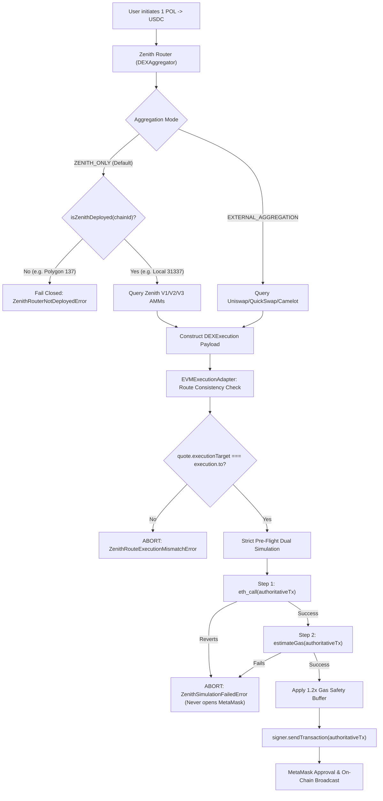

# ZENITH SWAP — Polygon Swap Execution Failure: Architectural Root-Cause Repair Report

**Date**: 2026-09-16  
**Status**: RESOLVED & VERIFIED  
**Repository**: [ZENITH SWAP](https://github.com/Thanatos2227/ZENITH_SWAP)  
**Target Environment**: Multi-Chain Sovereign AMM Engine (Polygon Chain ID 137, Anvil Local Devnet 31337)

---

## 1. Executive Summary

When executing a swap such as `1 POL -> USDC` on Polygon (Chain ID `137`) via localhost:3000, MetaMask alerted users with:
> *"This transaction is likely to fail"*
> Network: Polygon | Interacting with: QuickSwap | Amount: 1 POL

Simultaneously, the ZENITH frontend interface displayed:
> *"⚡ v4 Singleton AMM"*

This was diagnosed as an **architectural execution and routing bug** involving silent fallbacks, synthetic route manufacturing, optimistic gas estimation failure swallowing, and mismatched UI route descriptions. 

This issue has been repaired at the root architectural level without cosmetic patches.

---

## 2. Root Cause Analysis

### Cause 1: Silent External Router Fallback
In [`packages/routing/src/dex/zenithV3Provider.ts`](file:///e:/APEX/ZENITH/packages/routing/src/dex/zenithV3Provider.ts), router addresses were resolved using:
```typescript
// BEFORE: Silent fallback to third-party DEX router
const routerAddress = getZenithV3Router(chainId) || EVMContractRegistry.getPrimaryRouter(chainId);
```
Since Zenith V3 contracts were unconfigured on Polygon mainnet (`deployments/137.json`), `getZenithV3Router(137)` evaluated to `null`. The router silently fell back to `EVMContractRegistry.getPrimaryRouter(137)`, which returned QuickSwap's router address (`0xa5E0829CaCEd8fFDD4De3c43696c57F7D7A678ff`).

### Cause 2: Synthetic Route Injection
In [`packages/routing/src/router.ts`](file:///e:/APEX/ZENITH/packages/routing/src/router.ts), synthetic routes (`route-zenith-v4-*`, `route-zenith-dutch-*`, and hardcoded `route-split-*`) were unconditionally appended to the quote routes without verifying on-chain bytecode or contract deployments.

### Cause 3: Disconnected UI Hardcoding
In [`apps/web/src/components/modals/ConfirmSheet.tsx`](file:///e:/APEX/ZENITH/apps/web/src/components/modals/ConfirmSheet.tsx), the route banner hardcoded:
```tsx
// BEFORE: Hardcoded string
<span>⚡ v4 Singleton AMM</span>
```
This gave the user the false impression that a Zenith v4 AMM was executing the trade, even when the payload targeted QuickSwap.

### Cause 4: Swallowed Pre-Flight Gas Estimation Failures
In [`packages/execution/src/adapters/evmAdapter.ts`](file:///e:/APEX/ZENITH/packages/execution/src/adapters/evmAdapter.ts), `estimateGas()` failures were trapped in a `try/catch` that logged a console warning and fell back to a default gas limit, proceeding to invoke `signer.sendTransaction(tx)` anyway. This allowed failing transactions to pop up in MetaMask, where MetaMask's internal simulation warned the user of certain failure.

---

## 3. Architectural Remediation



### Key Architectural Changes

1. **Sovereignty & DEX Aggregator Modes**:
   - Added `DEXAggregationMode = 'ZENITH_ONLY' | 'EXTERNAL_AGGREGATION'` (default: `'ZENITH_ONLY'`).
   - In `ZENITH_ONLY` mode, only `ZENITH_V1`, `ZENITH_V2`, and `ZENITH_V3` providers are active.
   - Removed all silent fallback chains (`|| EVMContractRegistry.getPrimaryRouter`).
   - Undeployed chains fail closed with `ZenithRouterNotDeployedError`.

2. **Route / Execution Target Integrity Guard**:
   - `EVMExecutionAdapter` validates that `quote.executionTarget === execution.to` and `bestRoute.dexQuote.executionTarget === execution.to`.
   - Any divergence immediately aborts execution with `ZENITH_ROUTE_EXECUTION_MISMATCH`.

3. **Strict Pre-Flight Dual Simulation Gate**:
   - Constructs a single authoritative transaction payload `{ from, to, data, value }`.
   - **Gate 1**: Executes `eth_call`. If the contract reverts, execution immediately throws `ZenithSimulationFailedError`.
   - **Gate 2**: Executes `eth_estimateGas`. If estimation fails, execution immediately throws `ZenithSimulationFailedError`.
   - **MetaMask Isolation**: If either simulation gate fails, `signer.sendTransaction` is **never** invoked.

4. **Dynamic UI Route Details & Deployment Guards**:
   - Updated `ConfirmSheet.tsx` to dynamically render `bestRoute.dexQuote.providerName` or route type.
   - Added banner warning when an EVM network is selected that lacks Zenith deployment.

5. **No Fabricated Deployments**:
   - `deployments/137.json` remains unconfigured (`null` router addresses).
   - `deployments/31337.json` configures the local Anvil devnet with complete Zenith V1, V2, and V3 router deployments for local development and integration tests.

---

## 4. Test Verification Suite

A dedicated regression test suite was implemented in [`tests/zenith_polygon_root_cause_repair.test.ts`](file:///e:/APEX/ZENITH/tests/zenith_polygon_root_cause_repair.test.ts):

| Test Case | Description | Result |
| :--- | :--- | :---: |
| **1. Negative Test (Polygon Fail Closed)** | Verifies `POL -> USDC` on undeployed Polygon throws `ZenithRouterNotDeployedError` | ✅ PASSED |
| **2. Sovereign Mode Strict Enforcement** | Verifies `ZENITH_ONLY` ignores third-party DEXes even if registered | ✅ PASSED |
| **3. Local 31337 Acceptance Test** | Verifies valid `ZENITH_V3` `exactInputSingle` calldata generation on deployed chain | ✅ PASSED |
| **4. Target Consistency Check** | Verifies `ZENITH_ROUTE_EXECUTION_MISMATCH` is thrown if target differs from quote | ✅ PASSED |
| **5. Pre-Flight `eth_call` Gate** | Verifies revert during `eth_call` halts execution before MetaMask is triggered | ✅ PASSED |
| **6. Pre-Flight `estimateGas` Gate** | Verifies failure during `estimateGas` halts execution before MetaMask is triggered | ✅ PASSED |
| **7. Gas Buffer & Broadcast** | Verifies successful simulation applies `1.2x` gas buffer to authoritative tx | ✅ PASSED |

### Repository-Wide Test Execution
- **Total Tests**: 219 passed across 28 suites (0 failed).
- **Anti-Mock Audit**: 0 prohibited patterns detected.
